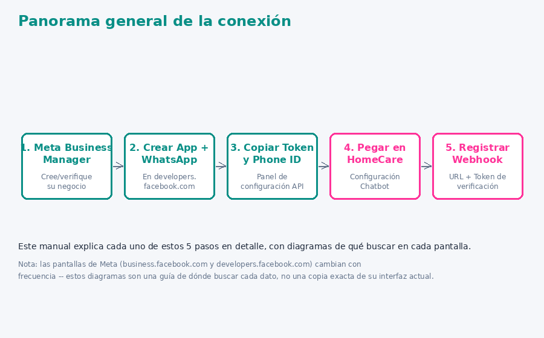
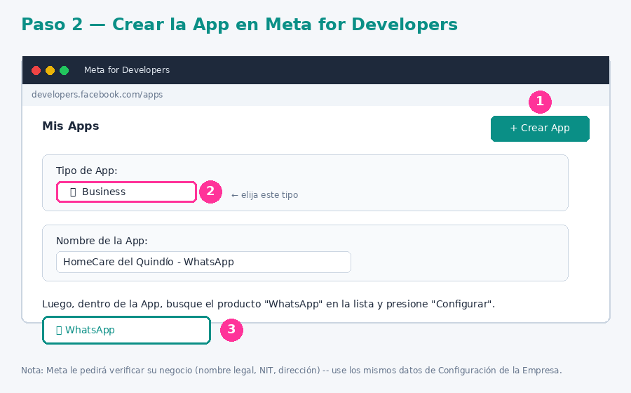
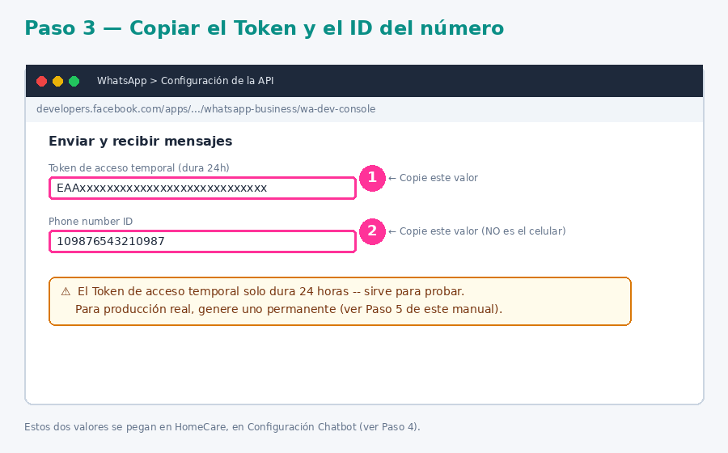
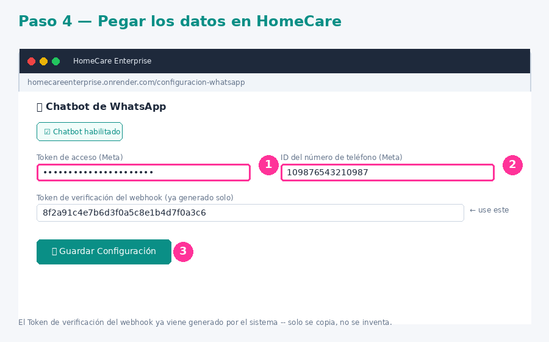
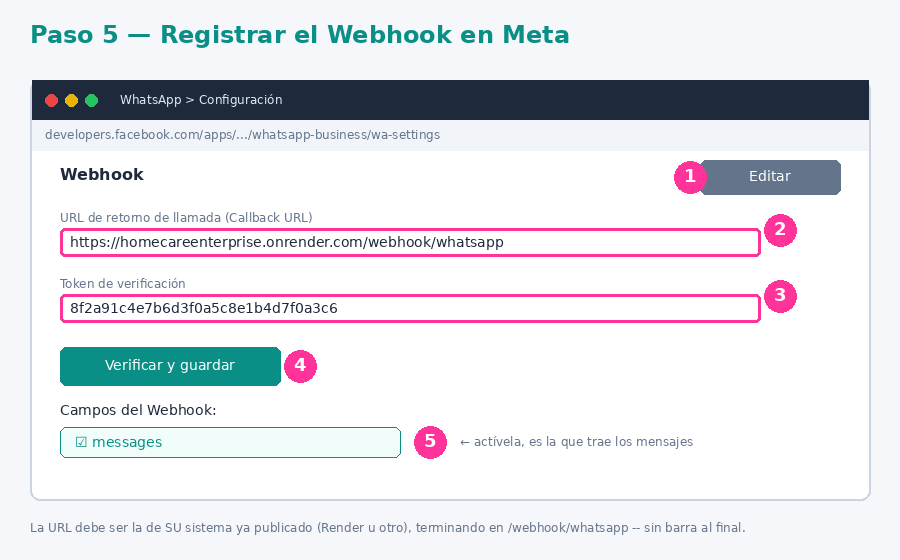
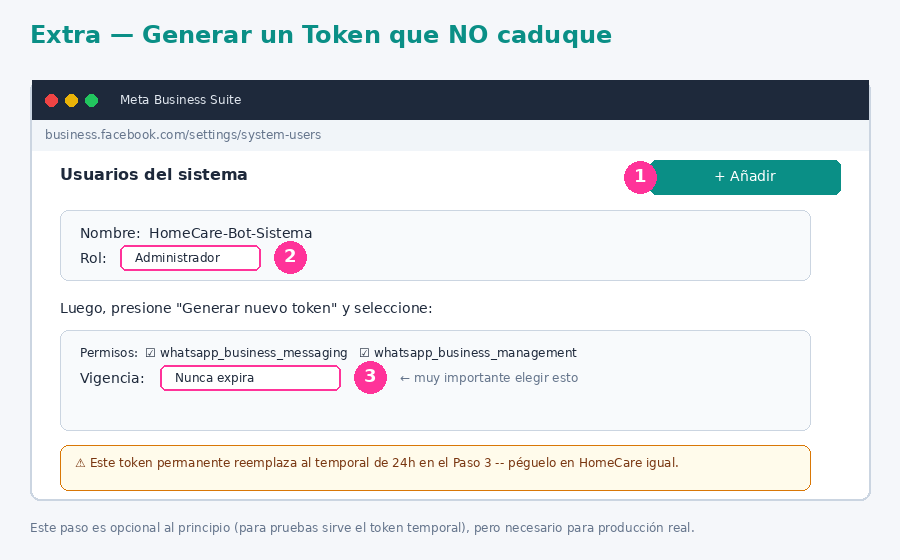
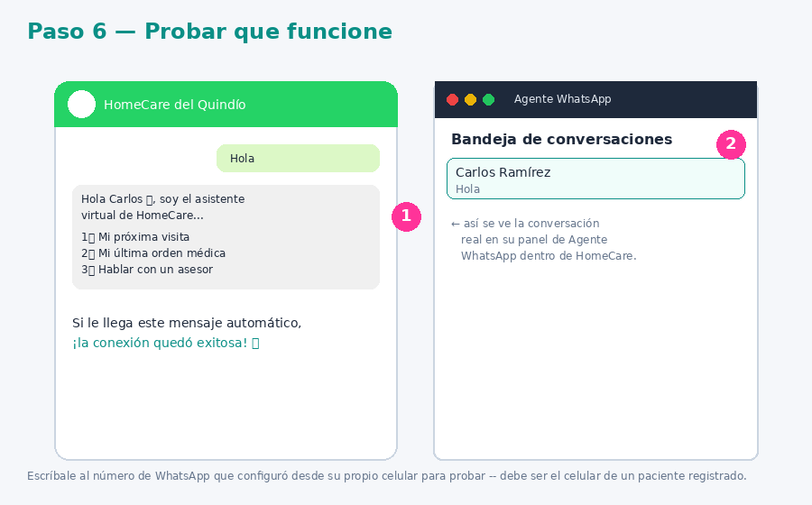

# Manual de Conexión de WhatsApp — Con Diagramas Paso a Paso

**HomeCare Enterprise — HomeCare del Quindío I.P.S.**

Este manual explica, con diagramas de cada pantalla, cómo conectar el Chatbot y el Agente de WhatsApp del sistema con la cuenta real de WhatsApp Business de la IPS.

> **Nota importante:** las pantallas de Meta (`business.facebook.com` y `developers.facebook.com`) cambian de apariencia con el tiempo, y son propiedad de Meta. Los diagramas de este manual son una **representación ilustrativa** de dónde queda cada botón y campo — no son capturas exactas de la interfaz actual de Meta, pero le mostrarán con precisión qué buscar y dónde hacer clic.

---

## Panorama general



Son 5 pasos, y solo se hacen una vez. Después de conectado, el sistema sigue funcionando solo.

---

## Paso 1 — Crear la cuenta en Meta Business Manager

1. Entre a [business.facebook.com](https://business.facebook.com) e inicie sesión (o cree la cuenta de la IPS si no la tiene).
2. Si es la primera vez, Meta le va a pedir verificar el negocio: nombre legal, NIT, dirección — use los mismos datos que ya tiene guardados en **Configuración de la Empresa** dentro de HomeCare.

---

## Paso 2 — Crear la App y agregar el producto WhatsApp



1. Vaya a [developers.facebook.com/apps](https://developers.facebook.com/apps) y presione **"Crear App"**.
2. Elija el tipo **"Business"**.
3. Póngale un nombre (ej: "HomeCare del Quindío - WhatsApp").
4. Dentro de la App ya creada, busque el producto **"WhatsApp"** en la lista y presione **"Configurar"**.

---

## Paso 3 — Copiar el Token y el ID del número de teléfono



Dentro de WhatsApp → **Configuración de la API** (a veces llamada "API Setup"), va a ver dos datos importantes:

1. **Token de acceso temporal** — cópielo (dura 24 horas, sirve para las primeras pruebas).
2. **Phone number ID** — cópielo también. **Esto NO es el número de celular en sí** (como "3001234567"), es un código numérico técnico que Meta le asigna a esa línea.

---

## Paso 4 — Pegar los datos en HomeCare



1. En HomeCare, vaya al menú **Chatbot WhatsApp** → **Configuración Chatbot**.
2. Marque la casilla **"Chatbot habilitado"**.
3. Pegue el **Token de acceso** y el **ID del número de teléfono** que copió en el Paso 3.
4. El **Token de verificación del webhook** ya viene generado solo por el sistema — no lo escribe usted, solo lo copia tal cual para usarlo en el siguiente paso.
5. Presione **"Guardar Configuración"**.

---

## Paso 5 — Registrar el Webhook en Meta



De vuelta en el panel de Meta, dentro de WhatsApp → Configuración:

1. Busque la sección **"Webhook"** y presione **"Editar"**.
2. En **"URL de retorno de llamada"**, escriba la dirección de su propio sistema terminando en `/webhook/whatsapp`. Por ejemplo:
   ```
   https://homecareenterprise.onrender.com/webhook/whatsapp
   ```
3. En **"Token de verificación"**, pegue exactamente el mismo token que copió del Paso 4.
4. Presione **"Verificar y guardar"** — si el token coincide, Meta lo confirma con un ✅.
5. Justo debajo, en **"Campos del Webhook"**, active la casilla **"messages"** — es la que hace que le lleguen los mensajes de los pacientes al sistema.

---

## Extra — Generar un Token que no caduque (para producción real)



El token del Paso 3 dura solo 24 horas — sirve para probar, pero no para el día a día. Para uno que no caduque:

1. En Meta Business Suite, vaya a **Configuración del negocio → Usuarios del sistema**.
2. Cree un "Usuario del sistema" nuevo, con rol **Administrador**.
3. Genere un token para ese usuario, con los permisos `whatsapp_business_messaging` y `whatsapp_business_management`, y vigencia **"Nunca expira"**.
4. Reemplace el token temporal por este, en la misma pantalla de Configuración Chatbot del Paso 4.

---

## Paso 6 — Probar que todo funcione



1. Desde el celular de un **paciente ya registrado en el sistema** (con el número correcto en su ficha), escríbale cualquier cosa al número de WhatsApp que configuró — por ejemplo, "hola".
2. Debe recibirle automáticamente el menú de bienvenida.
3. Al mismo tiempo, esa conversación debe aparecer en **Agente WhatsApp** dentro de HomeCare, donde un asesor puede tomarla y responder directamente si hace falta.

Si no le llega nada, revise en orden:

- Que el webhook haya quedado verificado (✅) en el panel de Meta.
- Que la casilla "messages" esté activada en los campos del webhook.
- Que "Chatbot habilitado" esté marcado en Configuración Chatbot.
- Que el número desde el que escribe esté guardado exactamente en el campo "Celular" de algún paciente.
- La tarjeta de estado en **Configuración de la Empresa** también le confirma si otras partes del sistema (como el reconocimiento facial) están activas — la lógica es la misma: revisar de arriba hacia abajo.

---

## Preguntas frecuentes

**¿Cuánto cuesta?**
Meta cobra por conversación después de cierto número de mensajes gratuitos al mes (varía según el país). Esto se revisa y se paga directamente en el panel de Meta Business — el sistema HomeCare no cobra ni administra esos pagos.

**¿Quién en la IPS puede ver o cambiar esta configuración?**
Solo el Administrador y quien tenga el permiso **"Chatbot de WhatsApp"** activado — esto se administra desde **Roles y Permisos**.

**¿Y si cambio de celular o de plan de WhatsApp Business más adelante?**
Solo tiene que repetir el Paso 3 (conseguir el nuevo Phone Number ID) y el Paso 4 (pegarlo en HomeCare) — el resto de la configuración (menús, flujos, mensajes) se queda igual.
